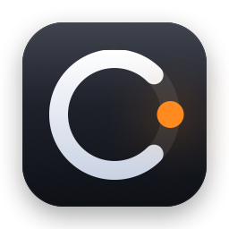
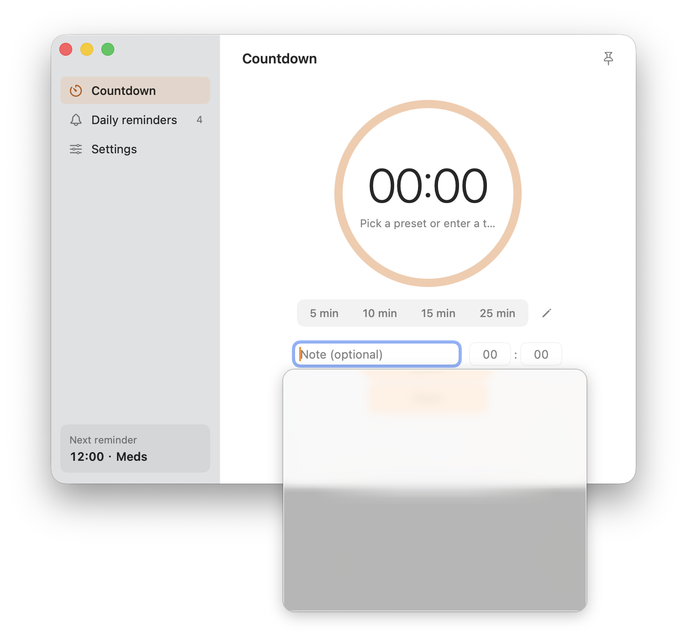
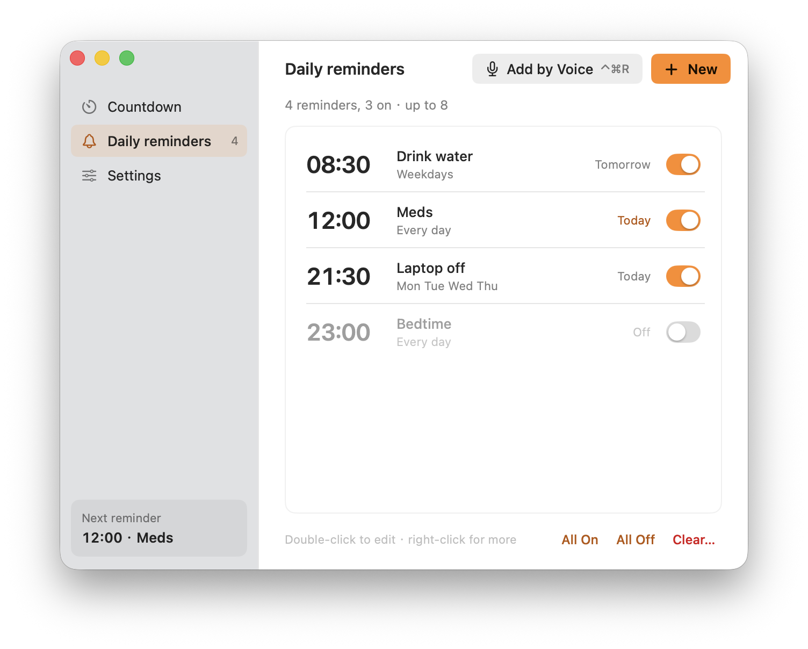
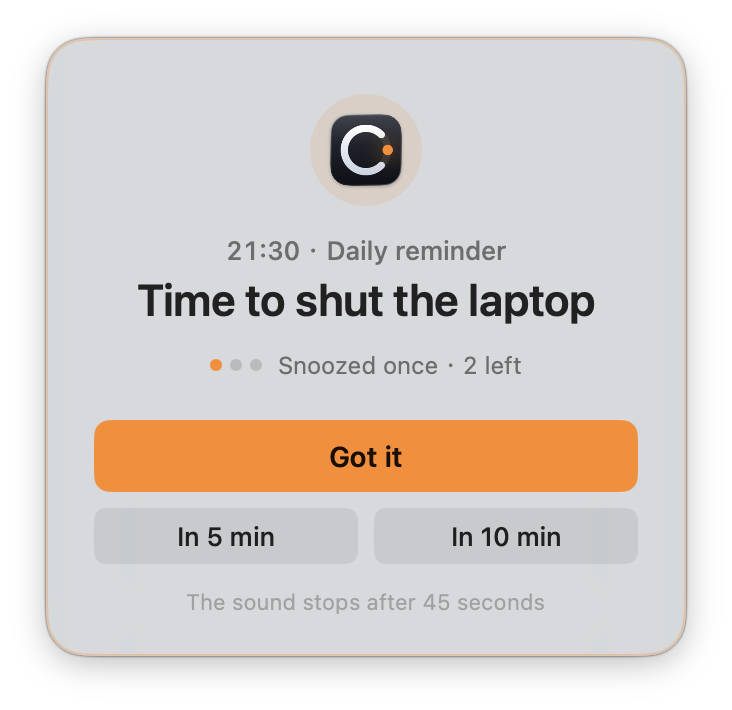
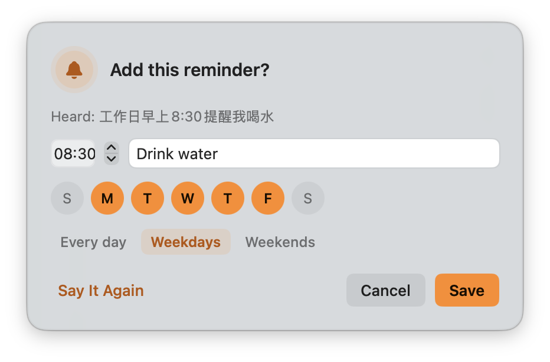
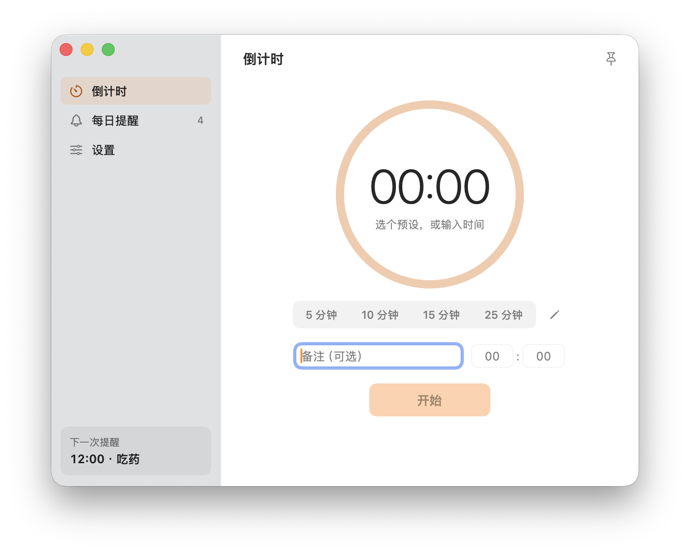
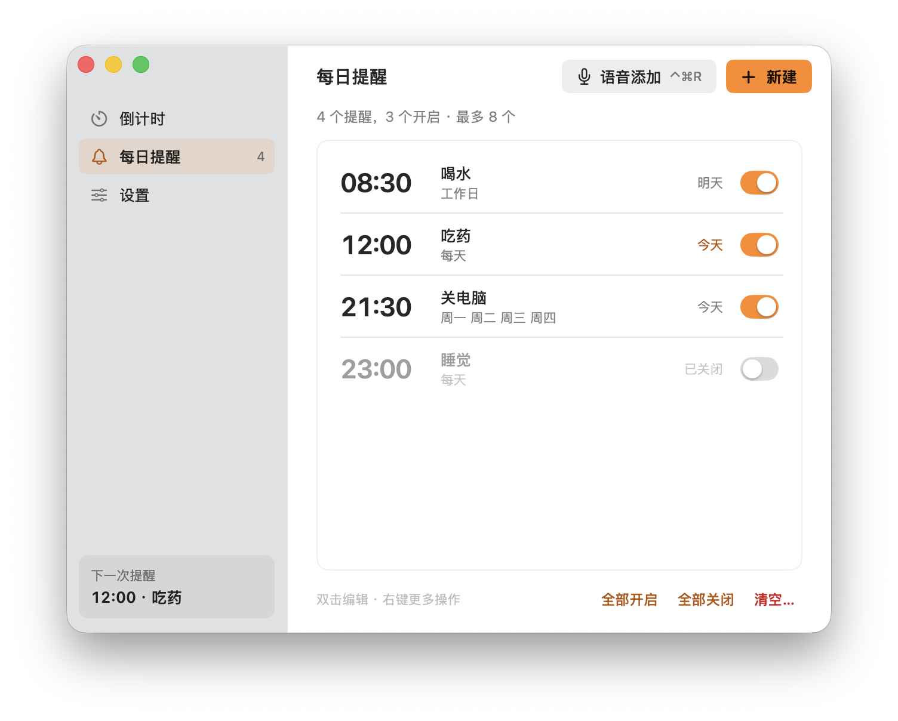
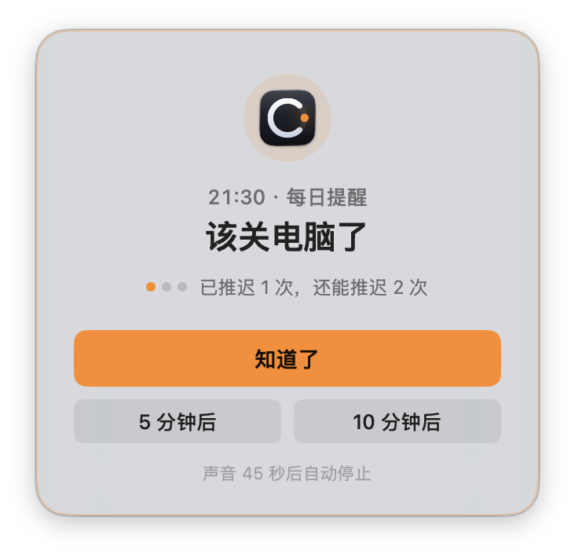
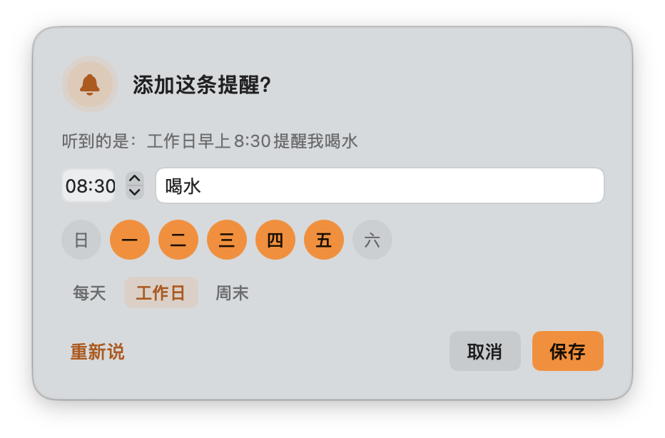

<p align="center"></p>

<h1 align="center">Chivvy</h1>

<p align="center"><a href="#english">English</a> | <a href="#中文">中文</a></p>

---

## English

Chivvy (formerly Tick) is a small macOS menu bar app for countdowns and daily pop-up reminders, with voice input. The interface is available in English and Chinese.

*chivvy* /ˈtʃɪvi/: to keep telling someone to do something until they do it. That's what the alert does: it floats over everything, including full-screen apps, and only lets you snooze a few times.

<p align="center">
  
  
</p>

### Features

**Countdown**
- Circular progress ring, preset buttons (editable, up to 5) and custom minutes + seconds
- Optional note, shown again when time is up
- Live countdown in the menu bar and on the Dock badge
- Repeat the last timer with one click
- Keyboard: Space pause / resume, Esc cancel, Return start

**Daily reminders**
- Up to 8 reminders, each repeating on the weekdays you pick (every day, weekdays, weekends, or any mix)
- The alert floats above everything, including full-screen apps, and plays a sound until you dismiss it (auto-stops after 45 s)
- Snooze 5 or 10 minutes, at most 3 times per reminder
- If the Mac was asleep at reminder time, the reminder still shows on wake if it's less than 30 minutes late
- If Chivvy isn't running, macOS delivers a regular notification instead
- A Reminders section in the main window to see them all at a glance, turn them on / off, edit, and batch on / off / delete

**Voice input**
- Press **⌃⌘R** anywhere and say one sentence in Chinese:
  - a relative time ("一分钟后提醒我睡觉") starts a countdown right away
  - a time of day ("工作日早上八点半提醒我喝水") opens a confirm card, then saves a daily reminder
- The shortcut can be changed in Settings

**Menu bar**
- Quick-start presets or custom minutes with a note
- See every reminder and toggle it on / off
- The running countdown with pause / cancel, plus voice input and reminders one click away

**Other**
- One main window with a sidebar: Countdown, Daily reminders, Settings
- Follows the system's light / dark appearance
- English / Chinese interface, switched in Settings or from the menu bar. It follows your system language on first launch.
- Always on top, launch at login

### Screenshots

| Reminder alert | Voice input |
|:---:|:---:|
|  |  |

### Voice Examples

| You say | Chivvy does |
|---|---|
| 一分钟后提醒我睡觉 | 1-minute countdown, note "睡觉" |
| 半小时后叫我起来 | 30-minute countdown, note "起来" |
| 倒计时 25 分钟 | 25-minute countdown |
| 每天晚上十一点提醒我睡觉 | Daily reminder at 23:00, every day, note "睡觉" |
| 工作日早上八点半提醒我喝水 | Daily reminder at 08:30, Mon–Fri, note "喝水" |
| 每周一三五晚上九点去跑步 | Daily reminder at 21:00, Mon / Wed / Fri, note "去跑步" |

Speech is turned into text by macOS's built-in speech recognition, on-device when the Chinese model is available. Chivvy then works out the time, days and note with its own rules. Nothing is sent to a third-party service.

A countdown starts right away, and Chivvy asks first if one is already running. A daily reminder always opens a confirm card, so you can fix anything that was misheard.

### Keyboard Shortcuts

| Key | Action |
|-----|--------|
| Space | Pause / resume the countdown |
| Esc | Cancel the countdown |
| Return | Start the countdown |
| ⌃⌘R | Voice input, from any app (customizable) |

### Install

Download `Chivvy.dmg` from [Releases](https://github.com/qingchejun/Chivvy/releases) and drag `Chivvy.app` to `/Applications`. If the latest version isn't there yet, build from source (below).

### Build from Source

```bash
git clone https://github.com/qingchejun/Chivvy.git
cd Chivvy
./build.sh            # Apple Silicon
./build.sh universal  # Apple Silicon + Intel
open /Applications/Chivvy.app
```

Requires macOS 13+ and Xcode Command Line Tools. The full Xcode app isn't needed.

### Permissions

| Permission | Why | When it's asked |
|---|---|---|
| Notifications | Backup alert when Chivvy isn't running | First launch |
| Microphone | Voice input | First time you press ⌃⌘R |
| Speech Recognition | Turn speech into text | First time you press ⌃⌘R |
| Login Items (optional) | Keep reminders working after a restart | When you turn on Auto-start |

### Development

```
Sources/Chivvy/
├── ChivvyApp.swift, AppDelegate.swift  App entry, menu bar setup
├── MainView.swift, MainSection.swift   Main window: sidebar and sections
├── TimerPane.swift                     Countdown section, preset editor
├── RemindersPane.swift                 Reminders section, edit sheet
├── SettingsPane.swift                  Settings section
├── Theme.swift                         Colors, spacing and shared controls
├── TimerManager.swift                  Countdown state
├── MenuBarManager.swift                Menu bar icon and popover
├── AlertPanel.swift, AlertText.swift   Floating alert panel and its wording
├── NotificationManager.swift           System notifications and alert sound
├── DailyReminder.swift                 Reminder model and scheduling logic
├── ReminderScheduler.swift             Fires reminders, snooze, sleep and wake handling
├── ReminderParser.swift                Understands spoken sentences
├── SpeechCapture.swift                 Microphone and speech recognition
├── VoiceReminder.swift                 Voice panel and flow
├── GlobalHotKey.swift                  System-wide shortcut
└── Localization.swift                  English / Chinese strings
```

Run the tests with `./Tests/run.sh`. They cover reminder scheduling, sentence parsing, shortcut handling, the language switch and the alert wording (263 assertions).

### What's New (v3.0)

- **Redesigned interface**: one main window with a sidebar for Countdown, Daily reminders and Settings. The separate Reminders window is gone.
- Brand orange is the single accent color; light and dark appearance follow the system.
- **New alert layout**: centered, with the note as the headline, dots for snoozes used, and a full-width "Got it" above the snooze buttons.
- **Menu bar**: rows highlight under the pointer, a running countdown shows as a card with a progress bar, presets sit in a compact grid.
- **Settings** gathers auto-start, always on top, language, the voice shortcut and presets in one place.
- Voice panel states share one set of round status icons.

### What's New (v2.2)

- **New name: Chivvy** (formerly Tick). Your reminders, settings and permissions carry over.
- **New icon**: a countdown ring shaped like a "C", with an alert dot. The menu bar icon matches it.
- Voice input ignores the app name in a sentence ("Chivvy，每天晚上11点提醒我睡觉").

### What's New (v2.1)

- **English interface**: switch between English and Chinese at any time with the globe button in the main window or from the menu bar. Open windows update right away. New installs follow the system language; upgrades from 2.0 stay in Chinese.
- Voice input still understands Mandarin only.
- **License**: from v2.1 Chivvy is licensed under PolyForm Noncommercial 1.0.0 (see [License](#license)).

### What's New (v2.0)

- **Daily reminders**: pick the weekdays; snooze 5 or 10 minutes, up to 3 times; reminders missed during sleep show on wake; a system notification is the backup when Chivvy isn't running
- **Reminders window**: see all reminders, toggle, edit, batch on / off / delete
- **Voice input**: ⌃⌘R (customizable); one sentence adds a daily reminder or starts a countdown
- **Chinese interface**
- **Fixes**:
  - the alert now shows over full-screen apps
  - the alert sound can no longer get stuck looping
  - cancelling no longer plays the completion animation
  - relaunching Chivvy no longer shows an already-dismissed reminder again
  - stricter number input

### What's New (v1.1)

- **Custom presets**: edit, add, remove and reorder preset buttons (up to 5), saved across launches
- **Repeat last timer**: one-click restart of the previous countdown (main window and menu bar)
- **Menu bar note input**: add a note when quick-starting from the menu bar
- **Launch at login**: toggle in the top toolbar
- **Always on top is remembered**: the pin setting survives closing and reopening the window
- **Completion animation**: the progress ring flashes green when time is up
- **Alert improvements**: the button now says "Got it", with an orange accent
- **Sound auto-stop**: the alert sound stops by itself after 45 seconds
- **Sleep resilience**: the timer refreshes right after the Mac wakes
- **Keyboard hints**: shortcut tips under the control buttons
- **Return to start**: press Return in any input field to start the timer

### License

[PolyForm Noncommercial 1.0.0](LICENSE). Copyright (c) 2026 青澈君.

- **Free for noncommercial use**: personal use, study, research, hobby projects, and use by charities, schools and public institutions. You may modify and share it, as long as you keep the license and the copyright notice.
- **Commercial use is not allowed without permission.** This includes selling Chivvy or a modified version, bundling it into a paid product or service, or using it inside a company for business purposes.
- For a commercial license, open an issue on GitHub.

Releases up to and including v2.0 were published under MIT and stay under MIT. The noncommercial license applies from v2.1 on.

---

## 中文

Chivvy（原名 Tick）是一个简洁的 macOS 菜单栏小工具：倒计时 + 每日弹窗提醒，支持语音添加。

*chivvy* /ˈtʃɪvi/：不停地催人去做某事，直到做完为止。这正是它的提醒方式：弹窗盖在所有窗口之上，全屏应用里也能看到，只能推迟有限几次。

<p align="center">
  
  
</p>

### 功能

**倒计时**
- 环形进度条，可自定义的预设按钮（最多 5 个），也可以输入任意分钟 + 秒
- 可选备注，时间到时会再显示一遍
- 菜单栏和 Dock 图标上实时显示剩余时间
- 一键重复上次计时
- 键盘操作：空格暂停/继续，Esc 取消，回车开始

**每日提醒**
- 最多 8 条，每条可以选择在星期几重复（每天、工作日、周末或任意组合）
- 到点弹出置顶提醒，全屏应用上也能看到，铃声循环直到你关掉（45 秒后自动停）
- 可以稍后 5 或 10 分钟再提醒，同一次提醒最多推迟 3 次
- 到点时电脑在睡眠，只要 30 分钟内唤醒，仍会补弹
- Chivvy 没有运行时，由系统通知兜底
- 主窗口的提醒页：集中查看所有提醒，单条开关、编辑，批量开启/关闭/删除

**语音输入**
- 在任何地方按 **⌃⌘R**，说一句话：
  - 说相对时间（"一分钟后提醒我睡觉"）：直接开始倒计时
  - 说具体时刻（"工作日早上八点半提醒我喝水"）：弹出确认卡片，保存后成为每日提醒
- 快捷键可以在设置里修改

**菜单栏**
- 快速开始预设或自定义分钟，可带备注
- 查看每条提醒，直接开关
- 运行中的倒计时可直接暂停/取消，语音输入和提醒管理一键直达

**其他**
- 一个带侧栏的主窗口：倒计时、每日提醒、设置
- 跟随系统浅色 / 深色外观
- 中英文界面，在设置或菜单栏里一键切换；首次启动跟随系统语言
- 窗口置顶、开机自启

### 截图

| 提醒弹窗 | 语音确认卡片 |
|:---:|:---:|
|  |  |

### 语音示例

| 你说 | Chivvy 会 |
|---|---|
| 一分钟后提醒我睡觉 | 开始 1 分钟倒计时，备注"睡觉" |
| 半小时后叫我起来 | 开始 30 分钟倒计时，备注"起来" |
| 倒计时 25 分钟 | 开始 25 分钟倒计时 |
| 每天晚上十一点提醒我睡觉 | 每日提醒：23:00，每天，备注"睡觉" |
| 工作日早上八点半提醒我喝水 | 每日提醒：08:30，周一到周五，备注"喝水" |
| 每周一三五晚上九点去跑步 | 每日提醒：21:00，周一 / 三 / 五，备注"去跑步" |

语音由 macOS 自带的语音识别转成文字，有中文离线模型时在本机完成。之后由 Chivvy 自己的规则解析出时间、星期和备注，不会发送给任何第三方服务。

倒计时会直接开始，如果已经有倒计时在进行会先问你是否替换。每日提醒一定会先弹出确认卡片，听错的地方可以当场改。

### 快捷键

| 按键 | 功能 |
|------|------|
| 空格 | 暂停 / 继续倒计时 |
| Esc | 取消倒计时 |
| 回车 | 开始倒计时 |
| ⌃⌘R | 语音输入，任何 App 里都能用（可自定义） |

### 安装

从 [Releases](https://github.com/qingchejun/Chivvy/releases) 下载 `Chivvy.dmg`，把 `Chivvy.app` 拖进 `/Applications`。如果那里还没有最新版本，请按下面的方法从源码构建。

### 从源码构建

```bash
git clone https://github.com/qingchejun/Chivvy.git
cd Chivvy
./build.sh            # Apple Silicon
./build.sh universal  # Apple Silicon + Intel 通用版
open /Applications/Chivvy.app
```

需要 macOS 13+ 和 Xcode Command Line Tools，不需要安装完整的 Xcode。

### 权限说明

| 权限 | 用途 | 什么时候请求 |
|---|---|---|
| 通知 | Chivvy 未运行时的兜底提醒 | 第一次启动 |
| 麦克风 | 语音输入 | 第一次按 ⌃⌘R |
| 语音识别 | 把说的话转成文字 | 第一次按 ⌃⌘R |
| 登录项（可选） | 重启后提醒照常工作 | 打开"开机自启"时 |

### 开发

```
Sources/Chivvy/
├── ChivvyApp.swift, AppDelegate.swift  应用入口、菜单栏初始化
├── MainView.swift, MainSection.swift   主窗口：侧栏和分区
├── TimerPane.swift                     倒计时页、预设编辑
├── RemindersPane.swift                 提醒页、编辑弹层
├── SettingsPane.swift                  设置页
├── Theme.swift                         颜色、间距和通用控件
├── TimerManager.swift                  倒计时状态
├── MenuBarManager.swift                菜单栏图标和弹出菜单
├── AlertPanel.swift, AlertText.swift   置顶提醒弹窗及其文案
├── NotificationManager.swift           系统通知和提醒铃声
├── DailyReminder.swift                 提醒数据和调度逻辑
├── ReminderScheduler.swift             到点触发、稍后提醒、睡眠唤醒处理
├── ReminderParser.swift                理解说的话
├── SpeechCapture.swift                 麦克风和语音识别
├── VoiceReminder.swift                 语音浮窗和流程
├── GlobalHotKey.swift                  全局快捷键
└── Localization.swift                  中英文文案
```

运行测试：`./Tests/run.sh`。覆盖提醒调度、句子解析、快捷键处理、语言切换和弹窗文案，共 263 条断言。

### 更新日志 (v3.0)

- **界面重新设计**：一个带侧栏的主窗口，分为倒计时、每日提醒、设置三页，不再单独弹出提醒管理窗口
- 全局只用品牌橙一个强调色，浅色 / 深色跟随系统
- **新的提醒弹窗**：居中排版，备注作为大标题，用小圆点显示已推迟次数，"知道了"整行放在推迟按钮上方
- **菜单栏面板**：悬停高亮，运行中的倒计时显示为带进度条的卡片，预设改成紧凑的按钮网格
- **设置页**集中了开机自启、窗口置顶、界面语言、语音快捷键和倒计时预设
- 语音面板各状态统一为圆形状态图标

### 更新日志 (v2.2)

- **改名为 Chivvy**（原名 Tick），原有的提醒、设置和系统权限都会保留
- **新图标**：C 形倒计时环加一个提醒点，菜单栏图标同步更新
- 语音输入会忽略句子里的应用名（"Chivvy，每天晚上11点提醒我睡觉"）

### 更新日志 (v2.1)

- **英文界面**：主窗口的地球按钮或菜单栏里随时切换中英文，已打开的窗口立即更新。新安装跟随系统语言，从 2.0 升级的保持中文。
- 语音输入目前仍只支持普通话。
- **许可证**：从 v2.1 起改用 PolyForm Noncommercial 1.0.0 非商业许可（见[许可证](#许可证)）。

### 更新日志 (v2.0)

- **每日提醒**：可选星期几；稍后 5 / 10 分钟，最多 3 次；睡眠中错过的提醒唤醒后补弹；Chivvy 未运行时由系统通知兜底
- **提醒管理窗口**：集中查看所有提醒，开关、编辑，批量开启 / 关闭 / 删除
- **语音输入**：⌃⌘R（可自定义），一句话添加每日提醒或开始倒计时
- **中文界面**
- **修复**：
  - 全屏应用上也能看到提醒弹窗
  - 提醒铃声不会再停不下来
  - 取消倒计时不再误播完成动画
  - 重启 Chivvy 不再重复弹出已经关掉的提醒
  - 数字输入校验更严格

### 更新日志 (v1.1)

- **自定义预设**：编辑、添加、删除、排序预设按钮（最多 5 个），持久化存储
- **重复上次计时**：一键重启上次倒计时（主窗口和菜单栏都可以）
- **菜单栏备注输入**：从菜单栏快速启动时可以添加备注
- **开机自启动**：左上角的自启开关
- **置顶状态持久化**：关闭窗口后重新打开仍保持置顶
- **完成动画**：倒计时归零时进度环闪绿
- **提醒优化**：按钮文案改为"Got it"，橙色醒目配色
- **声音自动停止**：提醒音 45 秒后自动停止
- **休眠恢复**：系统唤醒后立即刷新计时
- **快捷键提示**：控制按钮下方显示快捷键
- **回车键支持**：在任意输入框按回车即可开始计时

### 许可证

[PolyForm Noncommercial 1.0.0](LICENSE)（非商业许可），版权所有 (c) 2026 青澈君。

- **非商业用途免费**：个人使用、学习、研究、业余项目，以及公益组织、学校、公共机构使用都可以；也可以修改和分享，但必须保留许可证和版权声明。
- **未经授权禁止商用**：包括售卖 Chivvy 或其修改版、把它打包进收费的产品或服务、在公司内用于经营目的等。
- 如需商业授权，请在 GitHub 上提 Issue 联系。

v2.0 及之前的版本以 MIT 协议发布，这些版本仍适用 MIT；从 v2.1 起改用非商业许可。
