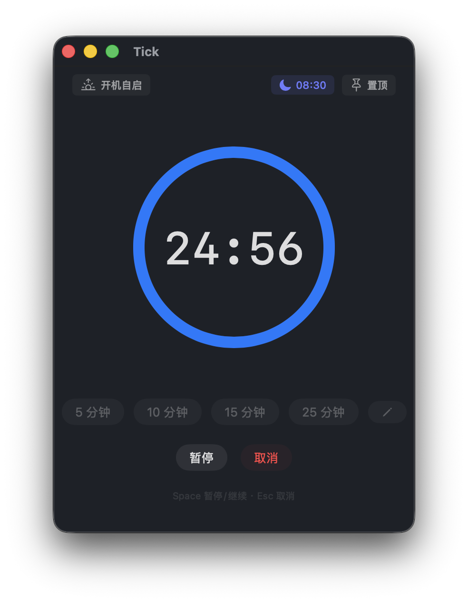
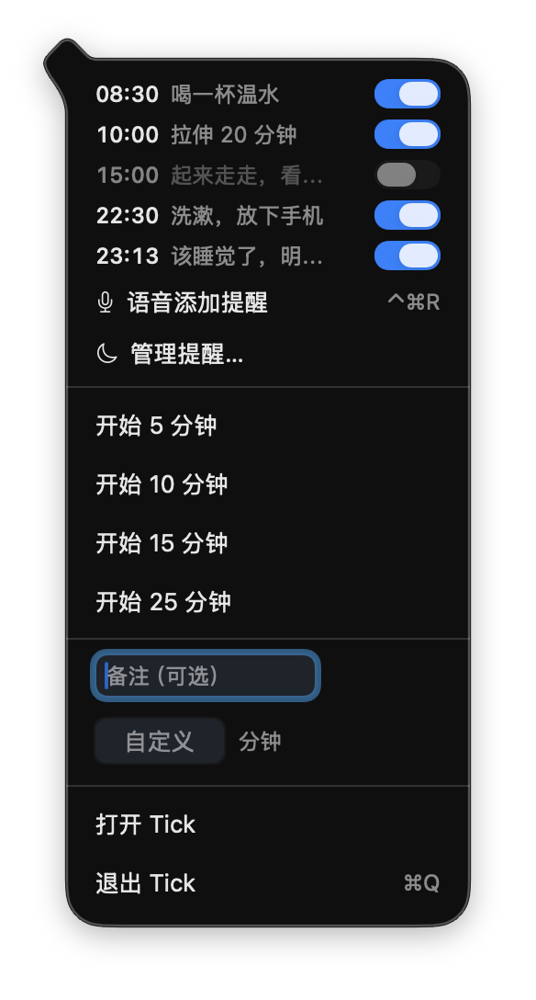

# Tick

[English](#english) | [中文](#中文)

---

## English

A small macOS menu bar app for countdowns and daily habit reminders, with voice input. The interface is in Chinese.

<p align="center">
  
  
  
</p>

### Features

**Countdown**
- Circular progress ring, preset buttons (editable, up to 5) and custom minutes + seconds
- Optional note, shown again when time is up
- Live countdown in the menu bar and on the Dock badge
- Repeat the last timer with one click
- Keyboard: Space pause / resume, Esc cancel, Return start

**Daily reminders**
- Up to 8 reminders, each repeating on the weekdays you pick (every day, weekdays, weekends, or any mix)
- The alert floats above everything, including full-screen apps, and plays a sound until you dismiss it (auto-stops after 45 s)
- Snooze 5 or 10 minutes, at most 3 times per reminder
- If the Mac was asleep at reminder time, the reminder still shows on wake if it's less than 30 minutes late
- If Tick isn't running, macOS delivers a regular notification instead
- A Reminders window to see them all at a glance, turn them on / off, edit, and batch on / off / delete

**Voice input**
- Press **⌃⌘R** anywhere and say one sentence in Chinese:
  - a relative time ("一分钟后提醒我睡觉") starts a countdown right away
  - a time of day ("工作日早上八点半提醒我喝水") opens a confirm card, then saves a daily reminder
- The shortcut can be changed at the bottom of the Reminders window

**Menu bar**
- Quick-start presets or custom minutes with a note
- See every reminder and toggle it on / off
- Voice input and the Reminders window are one click away

**Other**
- Always on top, launch at login

### Screenshots

| Reminder alert | Voice input | Menu bar |
|:---:|:---:|:---:|
|  |  |  |

### Voice Examples

| You say | Tick does |
|---|---|
| 一分钟后提醒我睡觉 | 1-minute countdown, note "睡觉" |
| 半小时后叫我起来 | 30-minute countdown, note "起来" |
| 倒计时 25 分钟 | 25-minute countdown |
| 每天晚上十一点提醒我睡觉 | Daily reminder at 23:00, every day, note "睡觉" |
| 工作日早上八点半提醒我喝水 | Daily reminder at 08:30, Mon–Fri, note "喝水" |
| 每周一三五晚上九点去跑步 | Daily reminder at 21:00, Mon / Wed / Fri, note "去跑步" |

Speech is turned into text by macOS's built-in speech recognition, on-device when the Chinese model is available. Tick then works out the time, days and note with its own rules. Nothing is sent to a third-party service.

A countdown starts right away, and Tick asks first if one is already running. A daily reminder always opens a confirm card, so you can fix anything that was misheard.

### Keyboard Shortcuts

| Key | Action |
|-----|--------|
| Space | Pause / resume the countdown |
| Esc | Cancel the countdown |
| Return | Start the countdown |
| ⌃⌘R | Voice input, from any app (customizable) |

### Install

Download `Tick.dmg` from [Releases](https://github.com/qingchejun/Tick/releases) and drag `Tick.app` to `/Applications`. If the latest version isn't there yet, build from source (below).

### Build from Source

```bash
git clone https://github.com/qingchejun/Tick.git
cd Tick
./build.sh            # Apple Silicon
./build.sh universal  # Apple Silicon + Intel
open /Applications/Tick.app
```

Requires macOS 13+ and Xcode Command Line Tools. The full Xcode app isn't needed.

### Permissions

| Permission | Why | When it's asked |
|---|---|---|
| Notifications | Backup alert when Tick isn't running | First launch |
| Microphone | Voice input | First time you press ⌃⌘R |
| Speech Recognition | Turn speech into text | First time you press ⌃⌘R |
| Login Items (optional) | Keep reminders working after a restart | When you turn on 开机自启 |

### Development

```
Sources/Tick/
├── TickApp.swift, AppDelegate.swift    App entry, menu bar setup
├── ContentView.swift                   Main window (countdown, presets)
├── TimerManager.swift                  Countdown state
├── MenuBarManager.swift                Menu bar icon and popover
├── AlertPanel.swift                    Floating alert panel
├── NotificationManager.swift           System notifications and alert sound
├── DailyReminder.swift                 Reminder model and scheduling logic
├── ReminderScheduler.swift             Fires reminders, snooze, sleep and wake handling
├── ReminderManagerView.swift           Reminders window
├── ReminderParser.swift                Understands spoken sentences
├── SpeechCapture.swift                 Microphone and speech recognition
├── VoiceReminder.swift                 Voice panel and flow
└── GlobalHotKey.swift                  System-wide shortcut
```

Run the tests with `./Tests/run.sh`. They cover reminder scheduling, sentence parsing and shortcut handling (199 assertions).

### What's New (v2.0)

- **Daily reminders**: pick the weekdays; snooze 5 or 10 minutes, up to 3 times; reminders missed during sleep show on wake; a system notification is the backup when Tick isn't running
- **Reminders window**: see all reminders, toggle, edit, batch on / off / delete
- **Voice input**: ⌃⌘R (customizable); one sentence adds a daily reminder or starts a countdown
- **Chinese interface**
- **Fixes**:
  - the alert now shows over full-screen apps
  - the alert sound can no longer get stuck looping
  - cancelling no longer plays the completion animation
  - relaunching Tick no longer shows an already-dismissed reminder again
  - stricter number input

### What's New (v1.1)

- **Custom presets**: edit, add, remove and reorder preset buttons (up to 5), saved across launches
- **Repeat last timer**: one-click restart of the previous countdown (main window and menu bar)
- **Menu bar note input**: add a note when quick-starting from the menu bar
- **Launch at login**: toggle in the top toolbar
- **Always on top is remembered**: the pin setting survives closing and reopening the window
- **Completion animation**: the progress ring flashes green when time is up
- **Alert improvements**: the button now says "Got it", with an orange accent
- **Sound auto-stop**: the alert sound stops by itself after 45 seconds
- **Sleep resilience**: the timer refreshes right after the Mac wakes
- **Keyboard hints**: shortcut tips under the control buttons
- **Return to start**: press Return in any input field to start the timer

### License

MIT

---

## 中文

一个简洁的 macOS 菜单栏小工具：倒计时 + 每日习惯提醒，支持语音添加。

<p align="center">
  
  
  
</p>

### 功能

**倒计时**
- 环形进度条，可自定义的预设按钮（最多 5 个），也可以输入任意分钟 + 秒
- 可选备注，时间到时会再显示一遍
- 菜单栏和 Dock 图标上实时显示剩余时间
- 一键重复上次计时
- 键盘操作：空格暂停/继续，Esc 取消，回车开始

**每日提醒**
- 最多 8 条，每条可以选择在星期几重复（每天、工作日、周末或任意组合）
- 到点弹出置顶提醒，全屏应用上也能看到，铃声循环直到你关掉（45 秒后自动停）
- 可以稍后 5 或 10 分钟再提醒，同一次提醒最多推迟 3 次
- 到点时电脑在睡眠，只要 30 分钟内唤醒，仍会补弹
- Tick 没有运行时，由系统通知兜底
- 提醒管理窗口：集中查看所有提醒，单条开关、编辑，批量开启/关闭/删除

**语音输入**
- 在任何地方按 **⌃⌘R**，说一句话：
  - 说相对时间（"一分钟后提醒我睡觉"）：直接开始倒计时
  - 说具体时刻（"工作日早上八点半提醒我喝水"）：弹出确认卡片，保存后成为每日提醒
- 快捷键可以在提醒管理窗口底部修改

**菜单栏**
- 快速开始预设或自定义分钟，可带备注
- 查看每条提醒，直接开关
- 一键打开语音输入和提醒管理窗口

**其他**
- 窗口置顶、开机自启

### 截图

| 提醒弹窗 | 语音确认卡片 | 菜单栏 |
|:---:|:---:|:---:|
|  |  |  |

### 语音示例

| 你说 | Tick 会 |
|---|---|
| 一分钟后提醒我睡觉 | 开始 1 分钟倒计时，备注"睡觉" |
| 半小时后叫我起来 | 开始 30 分钟倒计时，备注"起来" |
| 倒计时 25 分钟 | 开始 25 分钟倒计时 |
| 每天晚上十一点提醒我睡觉 | 每日提醒：23:00，每天，备注"睡觉" |
| 工作日早上八点半提醒我喝水 | 每日提醒：08:30，周一到周五，备注"喝水" |
| 每周一三五晚上九点去跑步 | 每日提醒：21:00，周一 / 三 / 五，备注"去跑步" |

语音由 macOS 自带的语音识别转成文字，有中文离线模型时在本机完成。之后由 Tick 自己的规则解析出时间、星期和备注，不会发送给任何第三方服务。

倒计时会直接开始，如果已经有倒计时在进行会先问你是否替换。每日提醒一定会先弹出确认卡片，听错的地方可以当场改。

### 快捷键

| 按键 | 功能 |
|------|------|
| 空格 | 暂停 / 继续倒计时 |
| Esc | 取消倒计时 |
| 回车 | 开始倒计时 |
| ⌃⌘R | 语音输入，任何 App 里都能用（可自定义） |

### 安装

从 [Releases](https://github.com/qingchejun/Tick/releases) 下载 `Tick.dmg`，把 `Tick.app` 拖进 `/Applications`。如果那里还没有最新版本，请按下面的方法从源码构建。

### 从源码构建

```bash
git clone https://github.com/qingchejun/Tick.git
cd Tick
./build.sh            # Apple Silicon
./build.sh universal  # Apple Silicon + Intel 通用版
open /Applications/Tick.app
```

需要 macOS 13+ 和 Xcode Command Line Tools，不需要安装完整的 Xcode。

### 权限说明

| 权限 | 用途 | 什么时候请求 |
|---|---|---|
| 通知 | Tick 未运行时的兜底提醒 | 第一次启动 |
| 麦克风 | 语音输入 | 第一次按 ⌃⌘R |
| 语音识别 | 把说的话转成文字 | 第一次按 ⌃⌘R |
| 登录项（可选） | 重启后提醒照常工作 | 打开"开机自启"时 |

### 开发

```
Sources/Tick/
├── TickApp.swift, AppDelegate.swift    应用入口、菜单栏初始化
├── ContentView.swift                   主窗口（倒计时、预设）
├── TimerManager.swift                  倒计时状态
├── MenuBarManager.swift                菜单栏图标和弹出菜单
├── AlertPanel.swift                    置顶提醒弹窗
├── NotificationManager.swift           系统通知和提醒铃声
├── DailyReminder.swift                 提醒数据和调度逻辑
├── ReminderScheduler.swift             到点触发、稍后提醒、睡眠唤醒处理
├── ReminderManagerView.swift           提醒管理窗口
├── ReminderParser.swift                理解说的话
├── SpeechCapture.swift                 麦克风和语音识别
├── VoiceReminder.swift                 语音浮窗和流程
└── GlobalHotKey.swift                  全局快捷键
```

运行测试：`./Tests/run.sh`。覆盖提醒调度、句子解析和快捷键处理，共 199 条断言。

### 更新日志 (v2.0)

- **每日提醒**：可选星期几；稍后 5 / 10 分钟，最多 3 次；睡眠中错过的提醒唤醒后补弹；Tick 未运行时由系统通知兜底
- **提醒管理窗口**：集中查看所有提醒，开关、编辑，批量开启 / 关闭 / 删除
- **语音输入**：⌃⌘R（可自定义），一句话添加每日提醒或开始倒计时
- **中文界面**
- **修复**：
  - 全屏应用上也能看到提醒弹窗
  - 提醒铃声不会再停不下来
  - 取消倒计时不再误播完成动画
  - 重启 Tick 不再重复弹出已经关掉的提醒
  - 数字输入校验更严格

### 更新日志 (v1.1)

- **自定义预设**：编辑、添加、删除、排序预设按钮（最多 5 个），持久化存储
- **重复上次计时**：一键重启上次倒计时（主窗口和菜单栏都可以）
- **菜单栏备注输入**：从菜单栏快速启动时可以添加备注
- **开机自启动**：左上角的自启开关
- **置顶状态持久化**：关闭窗口后重新打开仍保持置顶
- **完成动画**：倒计时归零时进度环闪绿
- **提醒优化**：按钮文案改为"Got it"，橙色醒目配色
- **声音自动停止**：提醒音 45 秒后自动停止
- **休眠恢复**：系统唤醒后立即刷新计时
- **快捷键提示**：控制按钮下方显示快捷键
- **回车键支持**：在任意输入框按回车即可开始计时

### 许可证

MIT
